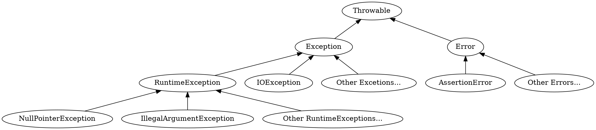
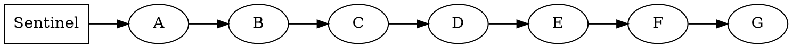
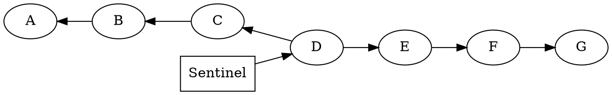
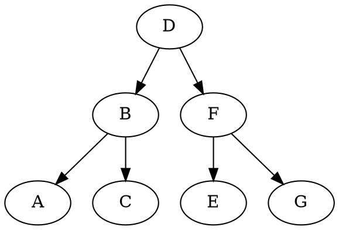
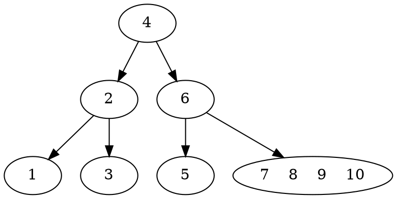
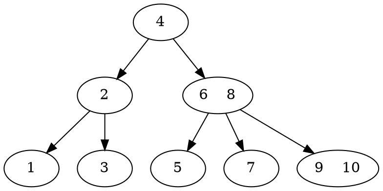

[TOC]

# Misc

## 测试

```java
import org.junit.Test;

public class testArrayMap {
    @Test
    public void testArrayMap0() {
        ArrayMap<String, Integer> am = new ArrayMap<String, Integer>();
        am.put("hello", 5);
        int expected = 5;
        assertEquals(expected, (int) am.get("hello"));    // 注意类型转换
    }
}
```

## 异常

```java
throw new IllegalArgumentException("can't add null");
```

```java
try {
    // do something
} catch (IllegalArgumentException e) {
    // do something
} catch (Exception e) { // catch all exceptions
    // do something
} finally {
    // do something
}
```

有的异常必须被捕获（checked exceptions），例如 `IOException`。如果代码不处理这些异常，编译器会报错。

<!--  generate dot code to illustrate the hierarchy of Throwable -->


除了 `Error` 和 `RuntimeException`，其他异常都是 checked exceptions。

```java
// 如果没有在方法内 catch 异常，就必须 throws 声明
public static void gulgate() throws IOException {
... throw new IOException("hi"); ...
}
```


## 变参

```java
// 注意，这个方法是静态的，因此它不知道自己所在类的类型参数
// 我们需要为它指定类型参数 T
public static <T> ArraySet<T> of(T... args) {
    ArraySet<T> res = new ArraySet<T>();
    for (T x : args) {
        res.add(x);
    }
    return res;
}
```


# 继承

## Access Control

未指定 package 时，当前类默认属于 default package，其他 package 的类无法访问 default package 中的类。

- Private ：和 C++ 相同
- Package Private：未指定访问控制符时的默认项，只有同一个 `package` 中的类可以访问，**但不能被子类访问**
- Protected：只有同一个 package 中的类以及自己的子类可以访问
- Public：和 C++ 相同

对于**接口**来说，默认的访问权限是 `public`，而不是 `package-private` 的。

和 C++ 一样，访问权限检查是基于**对象的静态类型**的。

```java
package universe;
public interface BlackHole {
    void add(Object x); // this method is public, not package-private!
}

package universe;
public class CreationUtils {
    public static BlackHole hirsute() {
         return new HasHair();
    }
}

package universe;
class HasHair implements BlackHole {    // package-private
    Object[] items;
    public void add(Object o) { ... }
    public Object get(int k) { ... }
}

import static CreationUtils.hirsute;
class Client {
   void demoAccess() {
      BlackHole b = hirsute();
      b.add("horse");    // ok
      b.get(0);          // error! get() is package-private, b can't access it even though b is a HasHair
      HasHair hb = (HasHair) b;    // error! Client has no idea what HasHair is
      // 判断方法：完全依照静态类型
   }
}
```

例如，`iterator()` 方法可以返回一个 `private` 的 `KeyIterator` 动态类型的对象，而 `KeyIterator` 类型是 `HashMap` 的内部类。

```java
public class ArrayMap<K, V> {
    // ...

    // 返回类型也可以是 KeyIterator
    public Iterator<K> iterator() {
        return new KeyIterator();
    }

    private class KeyIterator implements Iterator<K> {
        // ...
    }
}
```


## `implements`


```java
public interface List61B<Item> {
    public void addFirst(Item x);
    public void add Last(Item y);
    public Item getFirst();
    public Item getLast();
    public Item removeLast();
    public Item get(int i);
    public void insert(Item x, int position);
    public int size();

    // default 关键字允许在接口中提供方法定义
    default public void print() {
        for (int i = 0; i < size(); i++) {
            System.out.print(get(i) + " ");
        }
        System.out.println();
    }
}

public class SLList<Item> implements List61B<Item> {
    @Override
    public void addFirst(Item x) {
        ...
    }

    // 重写接口中的默认方法
    @Override
    public void print() {
        ...
    }
}
```

`interface` 的特性：
- 所有方法都必须 `public`
- 所有变量都必须 `public static final`
- 不可实例化
- 方法默认都是 `abstract` 的，除非指定 `default`
- 一个类可以实现多个接口


## `extends`

```java
public class RotatingSLList<Item> extends SLList<Item> {
    RotatingSLList() {
        // no-arg constructor super() will be called automatically by java if we don't call it explicitly
        super();
    }

    RotatingSLList(Item x) {
        super(x);    // must call explicitly, because java will only call super(), not super(x)
    }

    public void rotateRight();
}
```

java 中的所有类（`class`）都（隐式地）`extends` 了 `Object` 类，但接口（`interface`）不 `extends` `Object` 类。

## 多态


注意，重载函数并不适用多态关系：

```java
// Animal is an interface, Dog implements Animal
public static void func(Animal a) {
    System.out.println("Animal");
    a.say();    
}

public static void func(Dog d) {
    System.out.println("Dog");
    d.say();
}

public static void main(String[] args) {
    Animal a = new Dog();
    Dog d = new Dog();
    func(a);     // call func(Animal a), but inside func, it calls d.say()
    func(d);     // call func(Dog d)
}
// 这和 C++ 是一样的
```

多态的一些注意事项：

```java
class SLList<Item> {
    public void addLast(Item x) { ... }
    public void removeLast() { ... }
}

class VengefulSLList<Item> extends SLList<Item> {
    SLList<Item> deletedItems;

    @Override
    public Item removeLast() { ... }


    public void printLostItems() { ... }
}

public static void main(String[] args) {
    VengefulSLList<Integer> vsl = new VengefulSLList<Integer>(1);
    SLList<Integer> sl = vsl;    // ok, 基类引用指向派生类对象

    sl.addLast(50);    // ok，调用基类方法
    sl.removeLast();    // ok，调用派生类方法

    sl.printLostItems();    // 编译 error！基类没有这个方法
    VengefulSLList<Integer> vsl2 = sl;    // 编译 error！派生类引用不能指向基类对象
}
```

## Casting

```java
public static Animal maxAnimal(Animal a1, Animal a2);

public static void main(String[] args) {
    Animal a = new Dog();
    Dog d = new Dog();
    Dog maxd = maxAnimal(a, d);    // 编译 error！函数返回类型为 Animal
    Dog maxd = (Dog) maxAnimal(a, d);    // ok，强制类型转换

    MyDog md = new Dog();   // 编译 error！派生类引用不能指向基类对象
    MyDog md = (MyDog) new Dog();    // 编译ok，运行时异常！

    //...

    // 利用 instanceof 可以实现安全的向下转型
    if (d instanceof MyDog) {
        MyDog md = (MyDog) d;
    }
}
```

## `Comparable` 和 `Comparator`

java 中，有的对象之间可比较，有的不能。我们可以为一个类实现 `compateTo` 方法，使其对象可比较。然而不同类对 `compareTo` 方法的实现不一定相同，这为编写统一的操作函数（比如说，`max(Object a, Object b)` 函数）带来了困难。与其为 `Dog` 类实现 `maxDog`，再为 `Cat` 类实现 `maxCat`，不如令类的比较规范和统一。java 提供了 `Comparable` 接口，它要求派生类实现 `compareTo` 方法。

```java
public interface Comparable<T> {
    public int compareTo(T o);
}

public class Dog implements Comparable<Dog> {
    @Override
    // positive if >, negative if <, 0 if ==
    public int compareTo(Dog uddaDog) {
        return this.size - uddaDog.size;
    }
}
```

Natural order：`compareTo` 方法定义下的顺序。

假如我们想要将一个 `Dog[]` 按**不同于自然序**的顺序排序，我们可以利用 `Comparator`：

```java
// Comparator interface
public interface Comparator<T> {
    // positive if >, negative if <, 0 if ==
    public int compare(T o1, T o2);
}
```

```java
import java.util.Comparator;

public class Dog implements Comparable<Dog> {
    // ...
    public int compareTo(Dog uddaDog);

    // 私有 静态 嵌套类
    private static class NameComparator implements Comparator<Dog> {
        @Override
        public int compare(Dog a, Dog b) {
            return a.name.compareTo(b.name);
        }
    } 

    // getter
    public static Comparator<Dog> getNameComparator {
        return new NameComparator();
    }
}
```

## `abstract class`

`abstract class` 的特性：
- 方法可以是 `public` 或 `private`
- 变量不必是 `public static final`，可以是任意类型的
- 不可实例化
- 方法默认是 concrete 的，除非指定 `abstract`
- 一个类只能 `extends` 一个 `abstract class`

# Generics and autoboxing

## Autoboxing

| Primitive type | Wrapper class |
| :------------: | :-----------: |
|      byte      |     Byte      |
|      short     |     Short     |
|       int      |    Integer    |
|      long      |     Long      |
|      float     |     Float     |
|     double     |    Double     |
|     boolean    |    Boolean    |
|      char      |    Character  |

```java
public class BasicArrayList {
    public static void main(String[] args) {
      ArrayList<Integer> L = new ArrayList<Integer>();
      // L.add(new Integer(5));
      L.add(5);         // autoboxing: implicitly convert between primitives and wrapper classes

      /* Use the Integer.valueOf method to convert to int */
      // int first = L.get(0).valueOf();
      int first = L.get(0);    // autounboxing
    }
}
```

- 数组没有 autoboxing 和 autounboxing。`int[]` 和 `Integer[]` 之间不能简单替换
- 依赖 autoboxing 和 autounboxing 可能导致性能下降和存储空间浪费

## Widening

期待 `double` 的地方可以直接用 `int` 替代，但期待 `int` 的地方，`double` 不能直接替代，需要手动类型转换。

## Immutability

被声明为 `final` 的变量是 `const` 的。引用被声明为 `final`，不代表其指向的对象是 `const` 的。

```java
// deque 是 const 引用，但其指向的对象不是 const 的
public final ArrayDeque<String>() deque = new ArrayDeque<String>();
```
（不能像 C++ 一样直接声明一个不可变的引用对象）

## Generics

```java
// 必须在返回值前指定类型参数
public static <K,V> V get(Map61B<K,V> map, K key) {
    if map.containsKey(key) {
        return map.get(key);
    }
    return null;
}

// 和 C++ 不同，Java 对泛型的编译检查更严格
public static <K extends Comparable<K>, V> K maxKey(Map61B<K, V> map) {
    List<K> keylist = map.keys();
    K largest = map.get(0);
    for (K k: keylist) {
        if (k.compareTo(largest)) {
            largest = k;
        }
    }
    return largest;
}
```

`extends` 在泛型中的语义是“限制”，在继承与多态中的语义则是“扩展”。这里，虽然 `K` 实际上是 “`implements`” 了 `Comparable` 接口，但我们仍然使用 `extends`。


# Java 库

## `java.lang`

### `Object`

- `clone()`：一般应实现为深拷贝，即使 `x.clone() != x && x.clone().getClass() == x.getClass()`。`Object` 的默认实现只是简单地拷贝了对象的字段，即浅拷贝。
- `equals(Object o)`
- `getClass()`：返回运行时类型
- `hashCode()`
- `toString()`

`System.out.println(x)` 会隐式地调用 `x.toString()`。

`Object` 对 `toString()` 的默认实现会打印对象的内存地址。

`equals()` 和 `==` 有不同的语义。Java 中，`==` **检查两个对象是否指向同一个内存地址**（对 primitives 来说，检查值是否相等）。

`Object` 对 `equals()` 的默认实现就是 `==`。我们可以重写 `equals()` 以改变语义。

```java
public boolean equals(Object other) {
    if (this == other) return true;
    if (other == null) return false;
    if (other.getClass() != this.getClass()) return false;

    ArraySet<T> o = (ArraySet<T>) other;  // cast
    if (o.size() != this.size()) return false;
    for (T item : this) {
        if (!o.contains(item)) return false;
    }
    return true;
}
```

`equals()`：
- 必须拥有**自反性、对称性、传递性**
- 参数类型必须是 `Object`
- 若 `x.equals(y)`，那么只要 `x` 和 `y` 不变，`x.equals(y)` 的结果也不变
- `x.equals(null)` 必须返回 `false`


### `String`

和 C++ 不同的是，`"abc"` 这种字符串字面量也属于 `String`，`"abc".length()` 是合法的。

继承自 `Object` 的类都提供了 `toString` 方法。

一般地，向 `String` 类的函数传递 `null` 参数会抛出 `NullPointerException`。


- `Substring(int beginIndex, int endIndex=string.length())`
- `charAt(int index)`
- `indexOf(int ch, int fromIndex=0)`
- `indexOf(String str, int fromIndex=0)`：它们返回第一次出现的索引，如果没有找到，返回 `-1`。
- `concat(String str)`：效率比 `+` 高，但 `+` 可以实现字符串和其他类型的拼接
- `replace(char oldChar, char newChar)`
- `trim()`：去除首尾空格后的字符串


- （静态）`valueOf(Arg a)`：参数类型可以是 `boolean`、`char`、`int`、`long`、`float`、`double` 等等
- （静态）`format(String format, Object... args)`：格式化字符串

- `compareTo(String anotherString)`
- `compareToIgnoreCase(String str)`
- `startsWith(String prefix, int toffset=0)`：检查是否以 `prefix` 开头
- `endsWith(String suffix)`：检查是否以 `suffix` 结尾
- `equalsIgnoreCase(String anotherString)`
- `isEmpty()`
- `matches(String reges)`

一个天真的 `toString` 实现：

```java
public String toString() {
    String retStr = "{";
    for (int i = 0; i < size; i++) 
        retStr += items[i] + ", ";
    retStr += "}";
    return retStr;
}
```

由于 `String` 是不可变的，每次 `+=` 都会创建一个新的 `String` 对象，因此这种实现的时间复杂度是 `O(n^2)`。正确的实现应该使用 `StringBuilder`：

```java
public String toString() {
    StringBuilder retSB = new StringBuilder("{");
    for (int i = 0; i < size - 1; i++) 
        retSB.append(items[i].toString());
        retSB.append(", ");
    retSB.append(items[size - 1].toString());
    retSB.append("}");
    return retSB.toString();
}
```

利用 `String.join`：

```java
public String toString() {
    List<String> ls = new ArrayList<>();
    for (T x : this) 
        ls.add(x.toString());
    
    StringBuilder retSB = new StringBuilder("{");
    retSB.append(String.join(", ", ls));
    return retSB.append("}").toString();
}
```

## `java.util`

### 接口 `List`

- `add(int index=List.size(), E e)`：`true` 表示添加成功，对不允许重复的情况，`false` 表示参数已经在 `List` 中，添加失败。
- `addAll(int index=List.size(), Collection<? extends E> c)`
- `clear()`：清除所有
- `remove(int index)`：返回被删除的元素
- `remove(Object o)`：删除首个 `o`，返回是否删除成功
- `removeAll(Collection<?> c)`：删除所有 `c` 中的元素
- `retainAll(Collection<?> c)`：只保留所有 `c` 中的元素
- `set(int index, E element)`：返回被替换的元素
- `contains(Object o)`
- `containsAll(Collection<?> c)`
- `get(int index)`
- `indexOf(Object o)`
- `lastIndexOf(Object o)`
- `toArray()`：返回 `Object[]`
- `toArray(T[] a)`：如果装得下，结果装在 `a` 中并被返回，否则返回新的数组。返回值类型是 `T[]`，而不是 `Object[]。

- `iterator()`：返回 `Iterator<E>`
- `listIterator(int index=0)`：返回 `ListIterator<E>`


## `Iterable`

增强 `for` 循环

```java
Set<String> s = new HashSet<>();
// ...
for (String item: s) {
    // ...
}

// 等价于

Iterator<String> seer = s.iterator();
while (seer.hasNext()) {
    String item = seer.next();    // String item = seer++;
    // ...
}
```

`Iterable` 是一个接口：

```java
public interface Iterable<T> {
    Iterator<T> iterator();
}
```

`List` 继承自 `Collection`，而 `Collection` 继承自 `Iterable`。

`Iterator` 接口要求了 `hasNext` 和 `next` 方法，

```java
public interface Iterator<T> {
    boolean hasNext();
    T next();
}
```

当 `hasNext()` 返回 `false` 时，`next()` 的行为是未定义的（通常会抛出 `NoSuchElementException`）


## 文件

```java
File f = new File("dummy.txt");  // 这并不会创建 dummy.txt 文件本身

f.createNewFile();  // 创建文件
f.exists();         // 文件是否存在

File d = new File("dummy");  // 目录
d.exists();                  // 目录是否存在
d.mkdir();                   // 创建目录
```

### Serialization

```java
import java.io.Serializable;

public class Model implements Serializable {
    // Serializable 是一个标记接口 没有方法
    // ...
}
```

以下代码将 `m` 转换成字节流并写入 `model.save`：

```java
Model m = new Model();
File outFile = new File("model.save");
try {
    ObjectOutputStream out = new ObjectOutputStream(new FileOutputStream(outFile));
    out.writeObject(m);
    out.close();
} catch (IOException e) {
    // ...
}
```

以下代码重新从 `model.save` 中读取字节流并转换成 `Model` 对象：

```java
Model m;
File inFile = new File("model.save");
try {
    ObjectInputStream inp = new ObjectInputStream(new FileInputStream(inFile));
    m = (Model) inp.readObject();
    inp.close();
} catch (IOException | ClassNotFoundException e) {
    // ...
    m = null;
}
```


# Misc

## 命令行

`javac file` 将 `file` 编译为字节码文件 `file.class`。

`java file` 运行 `file.class`。如果 `file` 文件在某个 `package` 中，则需要在 `file` 的上级目录中通过 canonical name 运行，例如 `java capers.Main`。

## Git

`git checkout commitID`：将 `HEAD` 切换到某个提交（进入 HEAD-detached 状态），并将仓库恢复成此提交时的状态。之后的修改不会对仓库产生影响。此时可以执行 `git checkout -b new-branch-name` 创建新的分支（在 HEAD-detached 后修改的工作区内容和暂存区状态不会改变）

`git clone <remote_repo_url>`：克隆整个远程仓库，克隆后将作为 `origin` 添加到本地仓库的 `remote` 中

`git remote add <remote_name> <remote_repo_url>`：在本地仓库添加一个新的远程仓库

`git remote -v`：查看远程仓库

`git push <remote_name> <branch_name>`：将本地修改提交到远程仓库的 `branch_name` 分支

`git fetch <remote_name>`：将远程仓库的修改拉取到本地仓库的远程跟踪分支上

`git merge <branch_name>`：将 `branch_name` 分支合并到当前分支

`git pull <remote_name> <branch_name>`：`git fetch` + `git merge`，将远程仓库 `branch_name` 分支拉取合并到当前分支，当**没有需要合并的内容**时，发生 `Fast-forward`，此时 Git 将 `HEAD` 简单地指向 `branch_name` 分支的最新提交

`git restore <file_name>`：撤销工作区中 `file_name` 的修改，恢复到暂存区的状态

`git restore --staged <file_name>`：将暂存区中的 `file_name` 恢复成上一次提交的状态，如果 `file_name` 是上次提交以来的新文件，则等同于 `git rm --cached <file_name>`

`git rm --cached <file_name>`：从暂存区中移除 `file_name`，停止追踪它，不删除工作区中的文件，下次提交时，此文件会在仓库中被删除（如果之前有此文件）。可以用 `git restore --staged <file_name>` 撤销

`git rm <file_name>`：从暂存区中移除 `file_name`，并删除工作区中的文件


# DSA

## Union-Find / Disjoint Set

问题：给定多组整数对作为输入，每个整数对表示两个对象。如果两个对象在同一个整数对中，则它们是连通等价的（即有自反性、对称性、传递性）。设计一个算法，从输入中过滤掉所有无意义的整数对。

我们将每个整数称为一个触点（site），整数对关系称为连接（connection），连通的等价类称为分量（component）。

### QuickFind

```java
public class QuickFind implements UF {

    private int[] id; // id[site] = component id
    private int count; // amount of components

    // Init sites with 0 to N-1
    public QuickFind(int N) {
        count = N;
        id = new int[N];
        for (int i = 0; i != N; i++)
            id[i] = i;
    }

    @Override
    public void union(int p, int q) {
        // replace components containing p with component containing q
        // component id == one random site member
        int pid = find(p);
        int qid = find(q);
        if (pid == qid)
            return;
        // 此处为算法瓶颈：必须遍历整个数组以找出所有与 p 相连的触点
        // 同时注意到 id[p] 实际上是个毫无意义的值，考虑通过改变数据结构来优化掉遍历
        for (int i = 0; i != id.length; i++) {
            if (id[i] == pid)
                id[i] = qid;
        }
        count--;
    }

    @Override
    public int find(int p) {
        return id[p];
    }

    // amount of components
    @Override
    public int count() {
        return count;
    }

    public static void main(String[] args) {
        Scanner s = new Scanner(System.in);
        int N = s.nextInt();
        UF uf = new QuickFind(N);
        while (s.hasNext()) {
            int p = s.nextInt();
            int q = s.nextInt();
            if (uf.connected(p, q))
                continue;
            uf.union(p, q);
            System.out.println(p + " " + q);
        }
        System.out.println(uf.count() + " components");
        s.close();
    }
}
```

在quick-find 算法中，每次 `find()` 调用只需要访问数组一次，而归并两个分量的 `union()` 操作访问数组的次数在 $(N+3)$ 到 $(2N+1)$ 之间（`union()` 调用两次 `find()`，检查 $N$ 个数组的值，改变其中 $1$ 到 $N-1$ 个值）。算法的最好情况是 $(N+3)(N-1) ~ N^2$ 次访问，最坏情况是 $(2N+1)(N-1) ~ 2N^2$ 次访问。


### QuickUnion

优化：将 `id` 数组看作一棵树，`id[site]` 的值为 `site` 的父结点，规定根结点的父结点为自身（即 `id[root] == root`）。

```java
// find roots of p and q, link one to the other 
@Override
public void union(int p, int q) {
    int proot = find(p);
    int qroot = find(q);

    if (proot == qroot) return;
    id[proot] = qroot;    // 归并两棵树非常简单
    count--;
}

// now, component id == root of site
@Override
public int find(int p) {
    while (id[p] != p)
        p = id[p];
    return p;
}
```


定义**树的大小**为树中的结点数，某结点的**深度**是它到根结点的链接数。树的**高度**是它的所有节点中的最大深度。则 `find()` 操作访问数组的次数为 $1 + 2\operatorname{depth}(site)$，`connected()` 访问次数为 `find()` 的两倍，`union()` 访问次数为 `find()` 的两倍加 $0$ 或 $1$。

改良后，`find()` 需要访问 $1$ 到 $2N+1$ 次（当然，这通常会被编译优化为常数次）数组。最坏情况发生在整个网络只有一个分量，且所有结点连成一个线性表时。


### Weighted QuickUnion

我们会发现，算法的好坏取决于**树的高度**，只要使树的高度尽可能矮，算法的性能就会更好。因此优化的点在于：**避免大树被连接到小树的根结点上**。

通过保证大树不会被连接到小树的根结点，我们可以保证**树的高度**不会超过 $\lg N$。这样，`find()` 操作的访问次数就不会超过 $1 + 2\lg N$，`connected()` 和 `union()` 操作的访问次数就不会超过 $3 + 4\lg N$。

> 网络中，大小为 $k$ 的树的高度不超过 $\lg k$。因为将小树（大小记为 $i$）连接到大树（大小记为 $j$）的根结点后，原大树结点深度不变，原小树结点深度加 $1$，新树（大小为 $k=i+j$）深度不超过 $\lg i + 1 = 2\lg i \le \lg (i+j) = \lg k$。我们的优化本质上基于“每次让最少的结点深度增加”。

```java
public class WeightedQuickUnion implements UF {

    private int[] id;  // parent of i
    private int[] sz;  // size of component of root of i
    private int count; // amount of components

    public WeightedQuickUnion(int N) {
        count = N;
        id = new int[N];
        sz = new int[N];
        for (int i = 0; i != N; ++i) {
            id[i] = i;
            sz[i] = 1;
        }
    }

    @Override
    public void union(int p, int q) {
        int pid = find(p);
        int qid = find(q);
        if (pid == qid) return;
        if (sz[pid] < sz[qid]) {
            id[pid] = qid;    // small tree's root links to large tree's root

            // After this, depth of every site in the small tree increased by 1
            // depth of every site in the large tree remained the same
            // So essentially, our optimization is to make sure that
            // the LEAST amount of sites have their depth increased
            
            // Why only update sz[qid]?
            // We only care about size of a root, 
            // because we only access the size array by a ROOT index
            // Thus we don't care what any sz[NonRoot] is -- we'll never use it
            sz[qid] += sz[pid];    
        } else {
            id[qid] = pid;
            sz[pid] += sz[qid];
        }
        count--;
    }

    @Override
    public int find(int p) {
        if (p != id[p])
            p = id[p];
        return p;
    }

    @Override
    public int count() {
        return count;
    }
}
```

更多的优化：**路径压缩**。

在 `find()` 中添加一个循环，将路径上遇到的所有结点都链接到根结点，这相当于**备忘录**，既然我们**只关心根结点是否相同**，那么其他叶结点的信息便可以丢弃了，让每个“没用”的叶结点充当到根结点的快速移动通道，从而达到优化的目的。


以上的三种算法就是**并查集**（Disjoint Set）的实现。


## Binary Search Tree

### Basics

考虑一个有序单链表，它需要线性时间才能完成 `contains()` 和 `add()` 操作：



为了提高效率，我们改变链表的结构，于是搜索时间减半了！



递归地这样做：



**树**：由结点（Node）和连接（Edge）组成的数据结构。树的**任意两个结点之间都有且仅有一条路径**。

我们可以为树指定**根结点**，根结点没有父结点。

二叉树：每个结点最多有两个子结点。

BST Property：对每个结点 $X$，其左子树中的所有结点都小于 $X$，其右子树中的所有结点都大于 $X$。

BST 中的序关系必须有完全性、传递性和反对称性，BST **不允许重复的 Key**。

```java
// Pseuodo java code with naked recursion
// In this sample, a BST is equivalent to its root node
public class BST<K extends Comparable<K>> {

    private K key;
    private BST left;
    private BST right;

    public BST(K key, BST left, BST Right) {
        this.key = key;
        this.left = left;
        this.right = right;
    }

    public BST(K key) {
        this.key = key;
    }

    static BST find(BST T, K sk) {
        if (T == null)
            return null;
        if (sk.equals(T.key))
            return T;
        else if (sk.compareTo(T.key) < 0)
            return find(T.left, sk);
        else
            return find(T.right, sk);
    }

    // return a new BST with ik inserted
    static BST insert(BST T, K ik) {
        // base case of recursion
        if (T == null) return new BST(ik);
        
        // DO NOT WRITE:
        // if (n.left == null) n.left = new Node(key, val, 1);
        // else if (n.right == null) n.right = new Node(key, val, 1);
        // It just make code ugly, and what if n == null? You'll find the code above doesn't do your any good
        // TRUST THE RECURSION

        // Always set left and right pointers, even if nothing is actually changing
        if (ik.compareTo(T.key) < 0) T.left = insert(T, ik);
        else if (ik.compareTo(T.key) > 0) T.right = insert(T.right, ik);
        return T;
    }

    // return a new BST with dk deleted
    static <K extends Comparable> BST delete(BST T, K dk) {
        if (T == null) return null;

        if (dk.compareTo(T.key) < 0) T.left = delete(T.left, dk);
        else if (dk.compareTo(T.key) > 0) T.right = delete(T.right, dk);
        else {
            // T is the node to be deleted
            if (T.left == null) return T.right;
            if (T.right == null) return T.left;

            // T has two children
            // Find the smallest node in T's right subtree (the successor)
            // and replace T with it
            BST suc = T.right;
            while (suc.left != null) suc = suc.left;
            T.key = suc.key;

            // delete suc (optimizable because of repeated pathing for suc)
            T.right = delete(T.right, suc.key);  
        }
    }
}
```

如何删除结点？

- 待删结点没有子结点：将它的父连接删除即可
- 待删结点有一个子结点：将它的父连接指向它的子结点
- 待删结点有两个子结点：用它的后继结点（右子树中的最小结点）或前驱结点（左子树中的最大结点）替换它，然后删除后继结点或前驱结点（Hibbard deletion）

为什么？回忆顺序单链表，根结点就是单链表中的**中间值**，因此，新的根结点一定是**左子树中的最大值**或**右子树中的最小值**。

容易发现前两种情况只是第三种情况的特例。


#### 复杂度分析

**树的大小**为树中的结点数。

某结点的**深度（depth）**是它到根结点的链接数。

树的**平均深度（average depth）**是所有结点深度的平均值。

树的**高度（height）**是它的所有节点中的最大深度。


对于“bushy”的 BST 来说，其高度 $H=\Theta(\lg N)$，但对于“spindly”的 BST，其高度 $H=\Theta(N)$，这是 BST 的最坏情况：退化成顺序单链表。

对于一般的 BST，如果按顺序插入结点（1 -> 2 -> 3 -> ... -> 7），那么我们会得到一棵“spindly”的 BST（插入的每个结点都比父结点大 / 小，因此都会成为右 / 左子结点）；如果按由中间向两端的顺序插入结点（4 -> 2 -> 1 -> 3 -> 6 -> 5 -> 7），那么我们会得到一棵“bushy”的 BST。相同大小的 BST，后者的平均深度要小得多。

> 随机地插入结点，我们得到的 BST 的平均深度 $\sim 2 \ln N$，高度 $\sim 4.311 \ln N$
> 再加上随机地删除结点的操作，我们的 BST 的平均深度和高度是 $\Theta(\sqrt N)$ 的
> 然而我们的 BST 仍然可能是“spindly”的，因为实践中的插入和删除经常是有顺序的


### B Trees


一般 BST 的麻烦在于，我们**总是在叶结点下插入结点**，这导致树的高度增加，平衡结构也被破坏。

$\text{CRAZY IDEA}$：那就不要在叶结点下插入结点了！相反，我们把新的 key 塞进已有的叶结点中。



于是，树的高度不再增加，平衡结构得到了保持。然而我们注意到，叶结点会变得 overstuffed，退化成一个顺序单链表。

为每个结点设置最多可容纳的 key 数目 $L$，当 key 数超过 $L$ 时，我们就把结点分裂成两个结点，然后把中间的元素提升到父结点中。

例如对于 $L=3$，我们的 BST 会变成这样：


通过 $\text{overstuff}$ 和 $\text{splitting}$，我们让 BST 始终保持了完美的平衡。这样的树就是 **B 树**。特殊地，当 $L=2$ 时，B 树又叫 **$2$-$3$ 树**（表明每个结点可以有 $2$ 或 $3$ 个子结点）；当 $L=3$ 时，B 树就是 **$2$-$3$-$4$ 树**（每个结点可以有 $2$、$3$ 或 $4$ 个子结点）。

B 树的 $\text{invariants}$：
- **所有叶结点的深度相同**
- 每一个有 $k$ 个 $\text{key}$ 的非叶结点都一定有 $k+1$ 个子结点

这两条 $\text{invariants}$ 保证了 B 树永远是 bushy 的，其高度 $H=O(\lg N)$，插入和查找的复杂度都是 $O(\lg N)$。


### BST Map

```java
public class BST<K extends Comparable<K>, V> {
    private Node root;
    
    private class Node {
        private K key;
        private V val;
        private Node left, right;
        private int N;  // amount of nodes in subtree

        public Node(K key, V val, int N) {
            this.key = key;
            this.val = val;
            this.N = N;
        }
    }

    public int size() {
        return size(root);
    }

    private int size(Node x) {
        if (x == null) return 0;
        else return x.N;
    }

    // Search
    public V find(K key) {
        return find(root, key);    // recursive
    }

    private V find(Node x, K key) {
        if (x == null) return null;    // base case
        int cmp = key.compareTo(x.key);

        if (cmp < 0) return find(x.left, key);
        else if (cmp > 0) return find(x.right, key);
        else return x.val;
    }

    // Insert
    public void insert(K key, V val) {
        root = insert(root, key, val);    // recursive
    }

    private Node insert(Node n, K key, V val) {
        if (n == null) return new Node(key, val, 1);    // base case
        
        int cmp = key.compareTo(n.key);
        if (cmp < 0) n.left = insert(n.left, key, val);
        else if (cmp > 0) n.right = insert(n.right, key, val);
        else n.val = val;   
        n.N = size(n.left) + size(n.right) + 1;    // update size
        return n;
    }
}
```

```java
public void delete(K key) {
    root = delete(root, key);
}

private Node delete(Node n, K key) {
    if (n == null) return null;    // base case

    int cmp = key.compareTo(n.key);
    if (cmp < 0) n.left = delete(n.left, key);
    else if (cmp > 0) n.right = delete(n.right, key);
    else {
        if (n.right == null) return n.left;    // no right child
        if (n.left == null) return n.right;    // no left child

        // two children
        Node t = n;
        n = min(t.right);    // find successor
        n.right = deleteMin(t.right);    // delete successor
        n.left = t.left;
    }
}
``````


