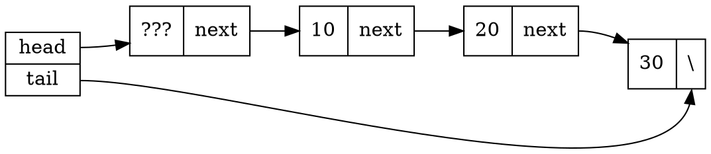
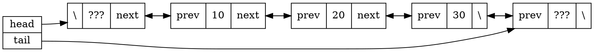
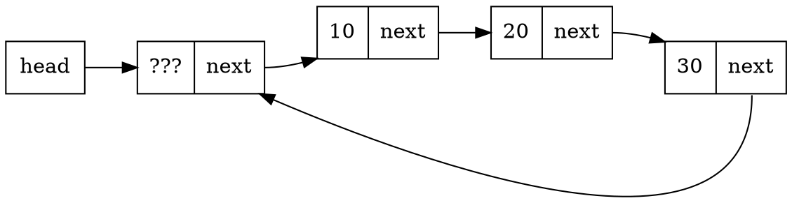
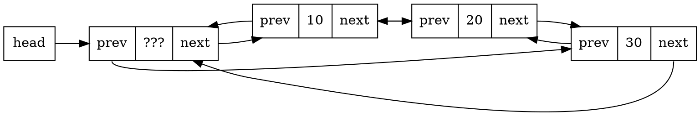

[TOC]

# Misc

数据结构：涉及数据之间的逻辑关系、在计算机的存储表示和在这种结构上的一组操作。

## 数据的逻辑结构

数据的逻辑结构可以用二元组 $B = (K,R)$ 表示。其中 $K$ 是数据结点的集合，$R$ 是 $K$ 上的二元关系集合。$K$ 上的二元组是 $K$ 中元素的有序对，记作 $\langle k, k' \rangle$.

若 $r \in R$，$k, k' \in K, \langle k, k'\rangle \in r$，则称 $k$ 是 $k'$ 在关系 $r$ 上的**前驱**，$k'$ 是 $k$ 在关系 $r$ 上的**后继**。没有前驱的结点称作开始节点，没有后继的结点称作终止结点。

## 数据的存储结构

逻辑结构 $(K,r)$ 的存储结构就是建立一种**由逻辑结构到物理存储空间的映射**：$k$ 映射为一段连续的内存空间，关系元组 $\langle k_i,k_j\rangle \in r$ 映射为存储单元的地址关系（顺序关系或指针指向关系）。 

常用的基本存储映射方法：
- 顺序存储：结点按地址相邻关系连续存储。紧凑（除结点外无附加信息）、存储密度大。
- 链接：利用指针指向表示结点逻辑关系
- 索引：建立索引函数 $Y:Z\rightarrow D$ 将结点的整数索引值映射到结点的存储地址。
- 散列


## 抽象数据类型

抽象数据类型（Abstract Data Type, ADT）是指一个数学模型及定义在该模型上的一组操作。抽象数据类型的定义取决于它的一组逻辑特性，而与其在计算机内部如何表示和实现无关。

可以用三元组 $(D,R,P)$ 表示：

```
ADT MyDataType {
    数据对象 D;
    数据关系 R;
    基本操作 P;
};
```

## 算法分析

大 $O$ 表示法：若 $\exists c, N > 0, \forall n \geq N, f(n) \leq cg(n)$，则 $f(n)$ 是 $O(g(n))$ 的。

$\Omega$ 表示法：若 $\exists c, N > 0, \forall n \geq N, f(n) \geq cg(n)$，则 $f(n)$ 是 $\Omega(g(n))$ 的。

$\Theta$ 表示法：若 $\exists c_1, c_2, N > 0, \forall n \geq N, c_1g(n) \leq f(n) \leq c_2g(n)$，则 $f(n)$ 是 $\Theta(g(n))$ 的。


# 线性表

用 $B=(K,R)$ 表示线性表，则：
$$
K=\{k_0, k_1, \cdots, k_{n-1}\} \\
R={r} \\
r=\{\langle k_i, k_{i+1}\rangle  | 0 \leq i \leq n-2\}
$$

线性关系 $r$ 刻画了元素之间的前驱 / 后继关系，满足**全序性**（所有结点都可两两比较前后）和**单索性**（每个非首尾结点都存在唯一前驱和后继）

存储结构：
- 顺序表：定长、顺序存储（数组）
- 链表：链式存储（指针）

## 单链表



尾指针可以加快对表尾的访问，引入头结点（header node，或称哨兵结点 sentinel node）有利于特殊情况（对空表插入、删除表中唯一的元素）的处理。


```c++
template <typename T>
class MySLL {
private:
    struct Node {
        T data;
        Node* next;
    };

    Node* head, tail;
    int size = 0;

public:
    MySLL() {
        head = tail = new Node;    // 头结点
    }
    ~MySLL() {
        Node* p = head;
        while (p) {
            Node* q = p;
            p = p->next;
            delete q;
        }
    }

    // pos 无意义则返回 nullptr
    Node* getNode(int pos) {
        int cnt = 0;
        if (pos == -1) return head;
        Node* p = head->next;
        for (; p; p = p->next) {
            if (cnt == pos) return p;
            cnt++;
        }
        return p;
    }

    void insert(int pos, T data) {
        Node* p = getNode(pos - 1);    // 定位到 pos-1
        if (!p) throw "invalid position";    // 注意检查返回值
        ++size;
        p->next = new Node(data, p->next);
        if (p == tail) tail = p->next;    // 末尾插入结点 需要对 tail 特殊处理
    }

    void remove(const int pos) {
        Node* p = getNode(pos - 1);    // 定位到 pos-1
        if (!p || !(p->next)) throw "invalid position";
        --size;
        Node* q = p->next;
        p->next = q->next;
        if (q == tail) tail = p;    // 删除末尾结点 需要对 tail 特殊处理
        delete q;    // 释放内存
    }
};
```

## 双链表

在单链表的基础上增加了 `prev` 指针。
另一方面，为了避免末尾的特判，**在末尾增加了一个哨兵结点**。



实现和单链表几乎一样。

```c++
template <typename T>
class MyDLL {
private:
    struct Node {
        T data;
        Node* prev, next;
    };

    Node* head, tail;
    int size = 0;

    // 注意需要纳入两个哨兵结点
    void checkLegalPos(int pos) {
        if (pos >= -1 && pos <= size) return;
        throw "illegal position";
    }

    Node* getNode(int pos) {
        checkLegalPos(pos);
        Node* p = nullptr;
        // 利用 size 的遍历优化 
        if (pos + pos < size) {
            p = head;
            while (pos-- != -1) p = p->next;  // 注意条件
        } else {
            p = tail;
            while (pos++ != size) p = p->prev;  // 两个条件对称
        }
        return p;
    }

public:
    MyDLL() {
        head = new Node(0);    // 头结点
        tail = new Node(0);    // 尾结点
        head->next = tail;
        tail->prev = head;
    }

    ~MyDLL() {
        Node* p = head;
        while (p) {
            Node* q = p;
            p = p->next;
            delete q;
        }
    }

    void insert(int pos, T data) {
        Node* p = getNode(pos - 1);
        ++size;
        Node* q = p->next;   
        p->next = new Node(data, q, p); 
        q->prev = p->next;
    }

    void remove(const int pos) {
        Node* p = getNode(pos - 1);
        --size;
        Node* q = p->next;
        Node* r = q->next;
        p->next = r;
        r->prev = p;
        delete q;
    }
    // 插入和删除结点无需对尾部特判
};
```

，

## 循环链表

和双哨兵结点一样，为了避免对尾部的特判，将链表头尾相连。

循环单链表：



循环双链表：



循环双链表中，`tail` 就是 `head`。连起来之后**所有结点都等价了**，自然就不会再有特判。

修改构造函数和析构函数：
```c++
    MyCircDLL() {
        head = new Node(0);    // 头结点
        head->next = head->prev = head;  // 自己连自己
    }

    ~MyCircDLL() {
        Node* p = head;
        while (size-- != -1) {    // 条件不能用 while(p) 因为是循环的
            Node* q = p;
            p = p->next;
            delete q;
        }
    }
```

**注意 `getNode` 的变化**：
```c++
Node* getNode(int pos) {
    checkLegalPos(pos);
    Node* p = head;    // 和双哨兵结点的不同在于 head 既是前哨兵又是后哨兵

    if (pos + pos < size) {
        while (pos-- != -1) p = p->next;  // 注意条件
    }
    else {
        while (pos++ != size) p = p->prev;  // 两个条件对称
    }
    return p;
}
```

# 栈与队列

## 栈

栈是只能在一端（栈顶）进行插入和删除的线性表，又称 LIFO 表。

```c++
template <typename T> 
class Stack {
public:
    void clear();
    bool push(const T item);
    bool pop(T& item);
    bool top(T& item);
    bool isEmpty();
    bool isFull();
};
```

**若 k 最后出栈，则 k 把入栈元素一分为二：k 前入栈的元素在其后入栈的元素之前出栈**。
（最后出栈 -> 入栈时，栈是空的）
如果入栈顺序 1, 2, 3, 4，则出栈顺序不可能是 1, 4, 2, 3
编程判定出栈序列是否合法
给定长度为 $N$ 的入栈序列，有 $C(N)=\sum_{i=0}^{N-1}C(i)C(N-i-1)=C_{2N}^N/(N+1)$ 种出栈序列（Catalan 数）。

### 顺序栈

采用顺序存储结构的栈是顺序栈（array-based stack）。栈顶一般为**数组尾**。

```c++
template <typename T>
class ArrStack : public Stack<T> {
private:
    T* data;      // Array
    int top = -1;  
    int maxSize;
    // ...
};
```

`top` 可以设置为**栈的第一个空闲位置**，即空栈 `top` 为 `0`；也可以设置为**栈的最后一个元素**，即空栈 `top` 为 `-1`。

### 链式栈

把单链表的头节点改名叫 `top`，就是链式栈（linked stack）。

```c++
template <typename T>
class LinkedStack : public Stack<T> {
private:
    struct Node {
        T data;
        Node* next;
    };

    Node* top = nullptr;
    int size;
    // ...
};
```

### 表达式求值

- 基本符号集：`[0-9+-*/\(\)]`
- 语法成分集：<表达式>、<项>、<因子>、<常数>、<数字>
- 语法公式集：又称产生式规则，用于定义语法成分
    - <表达式> ::= <项> + <项> | <项> - <项> | <项>
    - <项> ::= <因子> * <因子> | <因子> / <因子> | <因子>
    - <因子> ::= <常数> | (<表达式>)
    - <常数> ::= <数字> | <数字><常数>
    - <数字> ::= 0 | 1 | 2 | 3 | 4 | 5 | 6 | 7 | 8 | 9

上述为中缀表达法。

后缀表达式（逆波兰表示法）：运算符在两个参与运算的语法成分的后面，**不含括号**。其语法公式：
    - <表达式> ::= <项> <项> + | <项> <项> - | <项>
    - <项> ::= <因子> <因子> * | <因子> <因子> / | <因子>
    - <因子> ::= <常数>

中缀表达式 `infixExp` 转换为后缀表达式 `postfixExp`，**操作数的次序保持不变，操作符的次序发生改变**。

```c++
// Convert infix expression to postfix expression
for (int i = 0; i != 100; i++) {
    char e = infixExp[i];
    if (nums.constains(e)) {
        postfixExp += ' ' + e;
    }
    else if (e == '(') {
        stk.push(e);
    } 
    
    else if (e == ')') {
        if (stk.empty()) throw std::runtime_error("Invalid expression");
        while (stk.top() != '(') {
            postfixExp += ' ' + stk.top();
            stk.pop();
            if (stk.empty()) throw std::runtime_error("Invalid expression");
        }
        stk.pop();
    } 
    
    else if (ops.constains(e)) {
        while (true) {
            if (!stk.empty() && stk.top() != '(' &&
                (e == '*' || e == '/')) {
                postfixExp += ' ' + stk.top();
                stk.pop();
                stk.push(e);
            } else {
                postfixExp += ' ' + stk.top();
            }
        }
    }
}

while (!stk.empty()) {
    if (stk.top() == '(') throw std::runtime_error("Invalid expression");
    postfixExp += ' ' + stk.top();
    stk.pop();
}
```

## 队列

```c++
template <typename T>
class Queue {
public:
    void clear();
    bool enqueue(const T item);
    bool dequeue(T& item);
    bool front(T& item);
    bool empty();
    bool full();
};
```

两个栈模拟一个队列：入栈时 `push` 到栈 `A`，出栈时，将栈 `A` 元素全部 `pop` 到栈 `B`，再 `pop` 栈 `B` 的栈顶元素，最后将栈 `B` 的元素全部 `pop` 回栈 `A`。
### 两个队列模拟栈
两个队列模拟一个栈：

### 顺序队列

顺序队列（array-based queue）

如果队尾在数组尾，那么出队的时间是 $O(n)$ 的；如果在数组头，那么入队的时间是 $O(n)$ 的。

我们允许首尾位置可以移动。`front` 指针指向队列的首元素，`reer` 指针指向队列的**尾后元素**。出队时，`front` 指针右移一位；入队时，`rear` 指针右移一位。

然而随着时间推移，整个队列会向队尾移动，造成假溢出。解决方法是**循环队列**。

判断队列为空：`front == rear`

判断队列已满：`front == (rear + 1) % maxSize`（浪费一个空间）

### 链式队列

链式队列（linked queue）即用链表实现的队列。


# 字符串

字符串是组成元素为字符的线性表。

```c++
class String {
private:
    // defined by implementation
public:
    String();
    String(char* cstr);
    int length() const;
    int empty();
    void clear();
    String append(const char str);
    String concat(const char* str);
    String copy(const char* str c, const int start);
    String substr(const char c, const int start);
    ~String();r);
    String insert(const char c, const int index);
    int find(const cha
};
```

### 字符串的顺序存储

