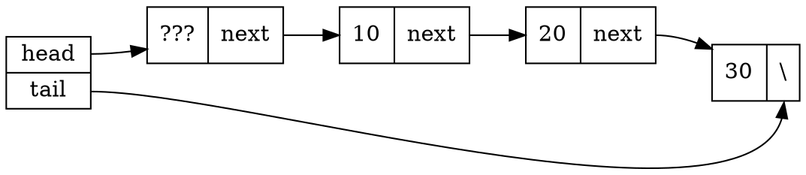
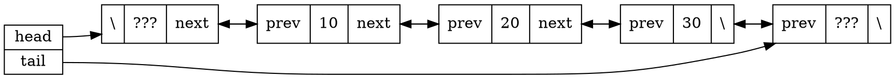
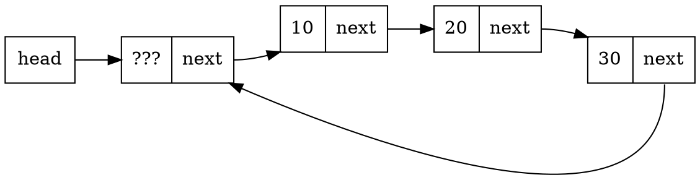
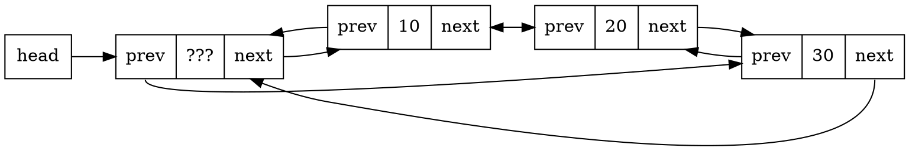

[TOC]

# Misc

## 数据的逻辑结构

数据的逻辑结构可以用二元组 $B = (K,R)$ 表示。其中 $K$ 是数据结点的集合，$R$ 是 $K$ 上的二元关系集合。$K$ 上的二元组是 $K$ 中元素的有序对，记作 $< k, k' >$.

若 $r \in R$，$k, k' \in K, < k, k'> \in r$，则称 $k$ 是 $k'$ 在关系 $r$ 上的**前驱**，$k'$ 是 $k$ 在关系 $r$ 上的**后继**。没有前驱的结点称作开始节点，没有后继的结点称作终止结点。

## 数据的存储结构

逻辑结构 $(K,r)$ 的存储结构就是建立一种**由逻辑结构到物理存储空间的映射**：$k$ 映射为一段连续的内存空间，关系元组 $<k_i,k_j> \in r$ 映射为存储单元的地址关系（顺序关系或指针指向关系）。 

常用的基本存储映射方法：
- 顺序
- 链接
- 索引
- 散列

## 抽象数据类型

抽象数据类型（Abstract Data Type, ADT）是指一个数学模型及定义在该模型上的一组操作。抽象数据类型的定义取决于它的一组逻辑特性，而与其在计算机内部如何表示和实现无关。

可以用三元组 $(D,R,P)$ 表示：

```
ADT MyDataType {
    数据对象 D;
    数据关系 R;
    基本操作 P;
};
```

## 算法分析

大 $O$ 表示法：若 $\exists c, N > 0, \forall n \geq N, f(n) \leq cg(n)$，则 $f(n)$ 是 $O(g(n))$ 的。

$\Omega$ 表示法：若 $\exists c, N > 0, \forall n \geq N, f(n) \geq cg(n)$，则 $f(n)$ 是 $\Omega(g(n))$ 的。

$\Theta$ 表示法：若 $\exists c_1, c_2, N > 0, \forall n \geq N, c_1g(n) \leq f(n) \leq c_2g(n)$，则 $f(n)$ 是 $\Theta(g(n))$ 的。


# 线性表

用 $B=(K,R)$ 表示线性表，则：
$$
K=\{k_0, k_1, \cdots, k_{n-1}\} \\
R={r} \\
r=\{<k_i, k_{i+1}> | 0 \leq i \leq n-2\}
$$

线性关系 $r$ 刻画了元素之间的前驱 / 后继关系。

存储结构：
- 顺序表：定长、顺序存储（数组）
- 链表：链式存储（指针）

## 单链表



尾指针可以加快对表尾的访问，引入头结点（header node，或称哨兵结点 sentinel node）有利于特殊情况（对空表插入、删除表中唯一的元素）的处理。


```c++
template <typename T>
class MySLL {
private:
    struct Node {
        T data;
        Node* next;
    };

    Node* head, tail;
    int size = 0;

public:
    MySLL() {
        head = tail = new Node;    // 头结点
    }
    ~MySLL() {
        Node* p = head;
        while (p) {
            Node* q = p;
            p = p->next;
            delete q;
        }
    }

    // pos 无意义则返回 nullptr
    Node* getNode(int pos) {
        int cnt = 0;
        if (pos == -1) return head;
        Node* p = head->next;
        for (; p; p = p->next) {
            if (cnt == pos) return p;
            cnt++;
        }
        return p;
    }

    void insert(int pos, T data) {
        Node* p = getNode(pos - 1);    // 定位到 pos-1
        if (!p) throw "invalid position";    // 注意检查返回值
        ++size;
        p->next = new Node(data, p->next);
        if (p == tail) tail = p->next;    // 末尾插入结点 需要对 tail 特殊处理
    }

    void remove(const int pos) {
        Node* p = getNode(pos - 1);    // 定位到 pos-1
        if (!p || !(p->next)) throw "invalid position";
        --size;
        Node* q = p->next;
        p->next = q->next;
        if (q == tail) tail = p;    // 删除末尾结点 需要对 tail 特殊处理
        delete q;    // 释放内存
    }
};
```

## 双链表

在单链表的基础上增加了 `prev` 指针。
另一方面，为了避免末尾的特判，**在末尾增加了一个哨兵结点**。



实现和单链表几乎一样。

```c++
template <typename T>
class MyDLL {
private:
    struct Node {
        T data;
        Node* prev, next;
    };

    Node* head, tail;
    int size = 0;

    // 注意需要纳入两个哨兵结点
    void checkLegalPos(int pos) {
        if (pos >= -1 && pos <= size) return;
        throw "illegal position";
    }

    Node* getNode(int pos) {
        checkLegalPos(pos);
        Node* p = nullptr;
        // 利用 size 的遍历优化 
        if (pos + pos < size) {
            p = head;
            while (pos-- != -1) p = p->next;  // 注意条件
        } else {
            p = tail;
            while (pos++ != size) p = p->prev;  // 两个条件对称
        }
        return p;
    }

public:
    MyDLL() {
        head = new Node(0);    // 头结点
        tail = new Node(0);    // 尾结点
        head->next = tail;
        tail->prev = head;
    }

    ~MyDLL() {
        Node* p = head;
        while (p) {
            Node* q = p;
            p = p->next;
            delete q;
        }
    }

    void insert(int pos, T data) {
        Node* p = getNode(pos - 1);
        ++size;
        Node* q = p->next;   
        p->next = new Node(data, q, p); 
        q->prev = p->next;
    }

    void remove(const int pos) {
        Node* p = getNode(pos - 1);
        --size;
        Node* q = p->next;
        Node* r = q->next;
        p->next = r;
        r->prev = p;
        delete q;
    }
    // 插入和删除结点无需对尾部特判
};
```

，

## 循环链表

和双哨兵结点一样，为了避免对尾部的特判，将链表头尾相连。

循环单链表：



循环双链表：



循环双链表中，`tail` 就是 `head->prev`。连起来之后**所有结点都等价了**，自然就不会再有特判。
只需要修改构造函数即可：
```c++
    MyCircDLL() {
        head = new Node(0);    // 头结点
        head->next = head->prev = head;  // 自己连自己
    }
```

# 遍历二叉树

## 前序遍历

递归遍历：

```c++
class TreeNode {
   public:
    int val;
    TreeNode* left;
    TreeNode* right;
    TreeNode() : val(0), left(nullptr), right(nullptr) {}
    TreeNode(int x) : val(x), left(nullptr), right(nullptr) {}
    TreeNode(int x, TreeNode* left, TreeNode* right)
        : val(x), left(left), right(right) {}
};

class Solution {
   public:
    vector<int> ans;
    void dfs(TreeNode* now) {
        if (now) {
            // 顺序：根->左->右
            // 改变以下三行的顺序即可实现中序遍历和后序遍历
            ans.push_back(now->val);
            dfs(now->left);
            dfs(now->right);
        }
    }
    vector<int> preorderTraversal(TreeNode* root) {
        dfs(root);
        return ans;
    }
};
```

非递归遍历：栈

```c++
// 二叉树定义略去
class Solution {
   public:
    vector<int> preorderTraversal(TreeNode* root) {
        stack<TreeNode*> stack;
        vector<int> results;
        if (root == NULL)
            return results;

        stack.push(root);

        while (!stack.empty()) {
            TreeNode* node = stack.top();
            stack.pop();                   // 出栈 
            results.push_back(node->val);
            if (node->right)
                stack.push(node->right);
            if (node->left)
                stack.push(node->left);
        }
        return results;
    }
};
```

## 中序遍历

非递归遍历：

```c++
class Solution {
public:
    vector<int> inorderTraversal(TreeNode* root) {
        vector<int> results;
        stack<TreeNode*> stack;
        TreeNode* now = root;

        while (now != nullptr || !stack.empty()) {
            // 向左搜到底 并压栈
            while (now != nullptr) {
                stack.push(now);
                now = now->left;
            }

            now = stack.top();
            stack.pop();
            results.push_back(now->val);
            now = now->right;  // 若为nullptr 则下次循环通过top()获得根节点
        }
        return results;
    }
};
```

## 后序遍历

非递归遍历：

```c++
vector<int> postorderTraversal(TreeNode* root) {
       TreeNode* p = root;
       vector<int> ret;
       stack<TreeNode*> s1;
       stack<TreeNode*> s2;
       if(p!=nullptr){
           s1.push(p);      // 头结点先压入s1中
       }
       while(!s1.empty()){
           p = s1.top();		// 每次从s1中弹出一个结点
           s1.pop();			// 弹出的结点压入s2中
           s2.push(p);

           if(p->left != nullptr){      // 先压左
               s1.push(p->left);
           }
           if(p->right != nullptr){
               s1.push(p->right);       // 再压右
           }
       }

       // 这样s1的顺序就是 根右左，s2的顺序就是左右根
       while( !s2.empty() ){
           ret.push_back(s2.top()->val);
           s2.pop();
       }
       return ret;
    }
```

更简单的办法：注意到后序遍历的结果恰好是按先右后左前序遍历的倒序。

```c++
class Solution {
   public:
    vector<int> preorderTraversal(TreeNode* root) {
        stack<TreeNode*> stack;
        vector<int> results;
        if (root == NULL)
            return results;

        stack.push(root);

        while (!stack.empty()) {
            TreeNode* node = stack.top();
            stack.pop();                   // 出栈 
            results.push_back(node->val);
            if (node->left)
                stack.push(node->left);
            if (node->right)
                stack.push(node->right);
        }
        reverse(results.begin(), results.end());
        return results;
    }
};
```